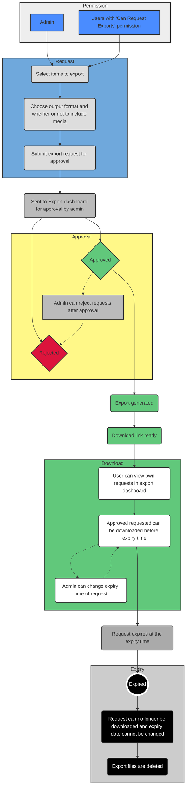

# Data Export

Export items from the database to multiple formats, optionally including related media files.

## Enabling

The export tool must be enabled in the environment configuration. See [Configuration](/deployment/configuration) for details.

## Permissions

- All administrators can make export requests
- Individual users can be granted the `Can Request Exports` permission
- Only administrators can approve or reject export requests

## Output Formats

| Format | Actor | Bulletin | Incident |
| --- | --- | --- | --- |
| PDF | Yes | Yes | Yes |
| JSON | Yes | Yes | Yes |
| CSV | Yes | Yes | No |
| Media | Yes | Yes | No |

PDF exports include all item fields and metadata in a formatted document. JSON exports contain the full structured data. CSV exports provide tabular data suitable for spreadsheet analysis. Media exports bundle all attached files.

## Workflow

1. Select items from the data table
2. Choose the export format and whether to include media
3. Submit the export request
4. An administrator reviews and approves or rejects the request
5. Once approved, the export file is available for download
6. Exports have an expiry time, after which they can no longer be downloaded and files are deleted

Administrators can adjust the expiry time or expire an export immediately if needed.

## Security

Export requests go through an approval workflow to prevent unauthorized data extraction. All export activity is logged in the [Activity Monitor](/guide/activity).

::: tip
The Data Export Tool was made possible by funding from the [International Coalition of Sites of Conscience](https://www.sitesofconscience.org/).
:::
