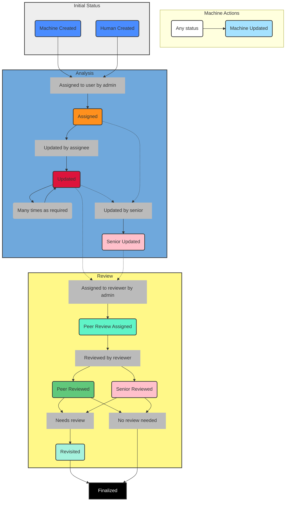

# Workflow

SJAC's analysts follow a strict workflow for the analysis of Actors and Bulletins. The workflow is enforced in Bayanat's UI and can only be overridden by an administrator.

This workflow serves as a project management tool within Bayanat. It allows users to filter the data by its status and provides useful insights into the team's progress.

SJAC's workflow and the statuses are shipped in Bayanat by default, but other users can add or remove status and make changes to this flow.

## Flowchart
The following chart describes the workflow designed by SJAC for its data analysis process:

 

### List of statuses
- Machine Created
- Human Created
- Assigned
- Updated
- Peer Review Assigned
- Peer Reviewed
- Revisited
- Senior Updated
- Senior Reviewed
- Machine Updated
- Finalized

## Process

### Initial statuses
When Actor/Bulletin/Incident is created in Bayanat, it will have either `Human Created` or `Machine Created` status, depending on whether it was created by a user or automatically imported.

### Analysis
This is the main part of the analysis workflow. Items in this phase are transformed from their raw condition to a processed state that can be filtered and linked to other items in the database.

Administrators or Moderators can assign items to analysts, changing the items status from their initial status to `Assigned`. The assignee can find items under this status and due to be processed using the "Assigned to me" shortcut. After processing these items, their status will be changed to `Updated`. The items can be updated as many times as required in this status by the assignee.

### Review
Peer review is an essential part of the analysis workflow. Not only it is the main tool for quality control of the analysis, in addition, it can be used as a learning tool, especially for new analysts.

Administrators or Moderators can assign items processed by analysts to other analysts for review, using the `Peer Review Assigned` status. At this point the original assignee can't make updates to the item until it's reviewed by the reviewer.

Reviewers can examine items fully, checking all fields completed by the assignee and comparing the data with the source and metadata. This amounts to a mock analysis done by a second pair of eyes. The reviewer can leave comments without making any changes to the data itself.

After the reviewer is done, the status of the item will be changed to `Peer Reviewed`, and the reviewer will need to indicated whether the item required review (contained issues to address) or not. If the item require reviewe, the assignee can make changes to the item to correct any issues, changing the status to `Revisited`. The assignee can also discuss any issues with the reviewer directly or within the team if there's disagreement about the review.

### Senior Actions
Administrators have the ability to make changes to all items in the database. While they are able to choose any status, the convention is to use `Senior Updated` or `Senior Reviewed`.

### Machine Actions
`Machine Updated` status is reserved for actions carried out automatically using a script or a tool within Bayanat.
