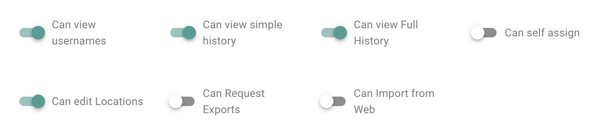

# Version
This threat model is up-to-date with <kbd>Bayanat v2.4</kbd>.

# Goal

-   Recognize, measure, and manage security risks related to Bayanat platform.
-   Safeguard the confidentiality, integrity, and availability of Bayanat's data, including documents, evidence, bulletins, actors, etc.
-   Mitigate vulnerabilities in Bayanat to minimize potential risks.
-   Enhance the overall security of Bayanat platform.

## Out of scope

-   It is beyond the scope of this threat model to address the security of the hosting infrastructure. Please follow industry best practices to ensure the security of your hosting infrastructure. Ensure that Bayanat can only be accessed through port 443, which should be allowed by any firewalls in use.
-   Evaluating third-party components security falls outside the scope of this project. However, it is recommended to keep all components up to date to mitigate potential security vulnerabilities.
-   Protection against Distributed Denial of Service (DDoS) attacks is not within the scope of this threat model. It is advisable to address DDoS threats separately and implement appropriate measures to mitigate the risks.

# Threat Surfaces

## Evaluated

-   Bayanat Databases/Storage.
-   Bayanat Codebase:
    -   Secrets and Keys.
    -   Source Code:
        -   Manually evaluated.
        -   Continious static analysis via SemGrep and CodeQL.
    -   Configuration Files.
-   Web UI vulnerability assessment via Tenable Nessus.
-   Docker (to be evaluated in a future release).

## Not Evaluated (Out of scope)

-   Hosting Infrastructure.
-   Third-Party Services:
    -   Nginx.
    -   Flask.
    -   Flask Extensions (i.e. bouncer).
    -   Vue and Vuetify.
    -   Redis.
    -   Postgres.
    -   Celery.
    -   Libraries & dependencies.

# Access Control

A comprehensive Access Control Model is implemented to manage user roles effectively within the system. The model includes several Bayanat user roles with specific access permissions:

## Bayanat Users

### Roles

-   The Data Analyst (DA) role grants users in this group both read and conditional write permissions. They are able to query Actors, Bulletins, and Incidents and Locations data, and have the ability to edit only the items assigned to them. Additionally, Data Analysts can review items assigned to them for peer review without making direct edits to these items.
-   The Moderators (Mod) role encompasses the same access as Data Analysts. In addition to their read and conditional write access in the Actors, Bulletins, and Incidents tabs, Moderators have read and write access to Labels, Sources, Event Types, and Locations. They also possess a bulk-update capability, allowing them to assist in managing the system effectively.
-   The Administrator role holds the highest level of access within the system. Users in this group have unrestricted access to all actions on the front end. They possess read and write access to all items in every tab, including Actors, Bulletins, and Incidents. Furthermore, Administrators have the ability to view the Activity Monitor and manage user accounts within the system.

### Permissions

Bayanat Access Control Model empowers administrators to grant specific permissions to individual users, enabling them to execute predefined actions and interact with Bayanat's features and metadata. By leveraging this granular approach, administrators can exercise fine-grained control over user privileges, ensuring that only authorized individuals can perform designated tasks. This security framework enhances data protection, safeguards sensitive information, and reduces the risk of unauthorized access or misuse. With the Security Access Control Model in place, Bayanat maintains a robust and trusted environment for managing data access and ensuring the utmost security for its users.

{.align-center}

## System Users

In addition, if installed according to the [_official installation guide_](/install), the Access Control Model adheres to the principle of granting only the necessary privileges to each of Bayanat’s backend system users. This approach ensures that the "www-data"/"nginx" user, typically associated with web server operations, does not have direct access to the sensitive "postgres" databases. As a result, even if the "www-data" user is compromised, the potential impact is limited to the frontend operations and does not extend to the backend databases.

## Authentication and Authorization 

Bayanat uses a suite of functionalities to validate and grant user requests for accessing any datasource, thereby providing protection against various security attacks, including session hijacking. By implementing this fine-grained access control, the model ensures that only authenticated and authorized users can access specific data sources based on their defined privileges and roles.

### Authentication

Bayanat’s authentication process employs a multi-factor authentication process to ensure stringent protection. Leveraging a diverse range of authorization techniques, this process is designed to elevate Bayanat’s security measures. Integrated within its framework are several layers of authentication, including the utilization of Recaptcha, Google OAuth, and Hardware Keys using WebAuthn & FIDO standards (our recommended setting). Recaptcha serves as an initial barrier, testing user authenticity through challenges that distinguish humans from automated systems. Google OAuth, a widely trusted protocol, enhances security by permitting access through Google accounts, adding an additional layer of verification. The inclusion of Hardware Keys utilizing WebAuthn & FIDO standards further bolsters security by employing physical devices for authentication (e.g. security key, biometric readers), making unauthorized access significantly more challenging. This comprehensive approach to authorization not only ensures the protection of Bayanat Platform but also allows administrators to set security policies for their Bayanat installations.

{.align-center}

### Authorization

On the other hand, Bayanat’s authorization process validates the legitimacy of user requests and prevents unauthorized access attempts, effectively mitigating the risk of potential security threats. With the implementation of this Access Control Model, the system establishes a robust and secure environment, adds an extra layer of enforced authentication to protect sensitive parts of Bayanat’s platform, safeguarding data sources and bolstering the overall security posture against a range of security attacks.

## Trust Levels

1.  Anonymous Web User.
2.  User with valid login credentials.
3.  User with Admin rights.
4.  User with DA rights.
5.  User with Mod rights.
6.  root local user.
7.  bayanat local user.
8.  nginx local user.
9.  postgres local user.

By implementing the above Access Control Model, Bayanat system ensures that different user roles are assigned appropriate access privileges, maintaining data security, integrity, and confidentiality while enabling efficient collaboration and workflow management.

# Assets Characterization & Data Flow Diagrams

## Secrets and Keys

### Data Characterization:

-   Trust Level Access: 6, 7, 8
-   Storage: Environment Variables.
-   Transmission: Terminal -> Env Var.
-   Execution Environment: Memory
-   Input: Manual by user.
-   Output: None.

## Users Login Credentials

### Data Characterization

-   Trust Level Access: 2, 6, 7, 9
-   Storage: Postgres DB.
-   Transmission: User browser -> Nginx -> SQLAlchemy -> Database.
-   Execution Environment: Memory
-   Input: 
    -   bayanat login page.
-   Output: None.

### Data Flow Diagram

{.align-center}

## [_Bulletins_](https://docs.bayanat.org/en/bulletin) Data 

### Data Characterization

-   Trust Level Access: 2, 3, 4, 5
-   Storage: Postgres DB, Redis DB, Disk Storage.
-   Transmission: 
    -   User browser -> Nginx -> SQLAlchemy -> Database.
    -   Nginx -> Redis -> Database.
    -   User browser -> Nginx -> Celery -> Database.
    -   User browser -> Nginx -> Disk Storage.
-   Execution Environment: Memory
-   Input:
    -   Bulletins Endpoint.
    -   Bulk Updates Endpoint.
    -   Media Uploads.
    -   Export Endpoint.
-   Output:
    -   Bulletins Endpoint.
    -   Export Endpoint.

### Data Flow Diagram

{.align-center}

## [_Actors_](https://docs.bayanat.org/en/actor) data 

### Data Characterization

-   Trust Level Access: 2, 3, 4, 5
-   Storage: Postgres DB, Redis DB, Disk Storage.
-   Transmission:
    -   User browser -> Nginx -> SQLAlchemy -> Database.
    -   Nginx -> Redis -> Database.
    -   User browser -> Nginx -> Celery -> Database.
    -   User browser -> Nginx -> Disk Storage.
-   Execution Environment: Memory
-   Input:
    -   Actors Endpoint.
    -   Bulk Updates Endpoint.
    -   Media Uploads.
    -   Export Endpoint.
-   Output:
    -   Actors Endpoint.
    -   Export Endpoint.

### Data Flow Diagram

{.align-center}

## [_Incidents_](https://docs.bayanat.org/en/incident) data 

### Data Characterization

-   Trust Level Access: 2, 3, 4, 5
-   Storage: Postgres DB, Redis DB.
-   Transmission:
    -   User browser -> Nginx -> SQLAlchemy -> Database.
    -   Nginx -> Redis -> Database.
    -   User browser -> Nginx -> Celery -> Database.
-   Execution Environment: Memory
-   Input:
    -   Incident Endpoint.
    -   Bulk Updates Endpoint.
    -   Export Endpoint.
-   Output:
    -   Incident Endpoint.
    -   Export Endpoint.

### Data Flow Diagram
{.align-center}

## Locations data 

### Data Characterization

-   Trust Level Access: 2, 3, 4, 5
-   Storage: Postgres DB, Disk Storage.
-   Transmission:
    -   User browser -> Nginx -> SQLAlchemy -> Database.
    -   User browser -> Nginx -> Disk Storage.
-   Execution Environment: Memory
-   Input:
    -   Locations Endpoint.
    -   User uploaded CSV file.
-   Output:
    -   Locations Endpoint.

### Data Flow Diagram

{.align-center}

## Sources data 

### Data Characterization

-   Trust Level Access: 3, 4, 5
-   Storage: Postgres DB, Disk Storage.
-   Transmission:
    -   User browser -> Nginx -> SQLAlchemy -> Database.
    -   User browser -> Nginx -> Disk Storage.
-   Execution Environment: Memory
-   Input:
    -   Sources Endpoint.
    -   User uploaded CSV file.
-   Output:
    -   Sources Endpoint.

### Data Flow Diagram

{.align-center}

## Labels data 

### Data Characterization

-   Trust Level Access: 2, 3, 4, 5
-   Storage: Postgres DB, Disk Storage.
-   Transmission:
    -   User browser -> Nginx -> SQLAlchemy -> Database.
    -   User browser -> Nginx -> Disk Storage.
-   Execution Environment: Memory
-   Input:
    -   Labels Endpoint.
    -   User uploaded CSV file.
-   Output:
    -   Sources Endpoint.

### Data Flow Diagram

{.align-center}

## Activities data 

### Data Characterization

-   Trust Level Access: 3
-   Storage: Postgres DB
-   Transmission:
    -   User browser -> Nginx -> SQLAlchemy -> Database.
-   Execution Environment: Memory
-   Input:
    -   None.
-   Output:
    -   Activities Log.

### Data Flow Diagram

{.align-center}

## User data 

### Data Characterization

-   Trust Level Access: 3
-   Storage: Postgres DB, Redis DB
-   Transmission:
    -   User browser -> Nginx -> SQLAlchemy -> Database.
    -   User browser -> Nginx -> Redis DB -> Database.
-   Execution Environment: Memory
-   Input:
    -   User Management Endpoint.
-   Output:
    -   User Management Endpoint.

### Data Flow Diagram

{.align-center}

## Roles data

### Data Characterization

-   Trust Level Access: 3
-   Storage: Postgres DB, Disk Storage.
-   Transmission:
    -   User browser -> Nginx -> SQLAlchemy -> Database.
    -   User browser -> Nginx -> Disk Storage.
-   Execution Environment: Memory
-   Input:
    -   Roles Endpoint.
    -   User uploaded CSV file.
-   Output:
    -   Roles Endpoint.

### Data Flow Diagram

{.align-center}

## Data Import data 
### Data Characterization
- Trust Level Access: 3, 6, 9
- Storage: Postgres DB, Disk Storage.
- Transmission:
	- User browser -> Nginx -> SQLAlchemy -> Database.
- Execution Environment: Memory
- Input:
	- User’s uploaded media files.
	- User’s uploaded CSV files.
- Output:
	- Import Log.
	- Data Import Endpoint.
### Data Flow Diagram

{.align-center}

## System Settings data 

### Data Characterization

-   Trust Level Access: 2, 3, 4, 5
-   Storage: Postgres DB, Disk Storage.
-   Transmission:
    -   User browser -> Nginx -> SQLAlchemy -> Database.
-   Execution Environment: Memory
-   Input:
    -   Settings Endpoint.
-   Output:
    -   Settings Endpoint.

### Data Flow Diagram

{.align-center}

## System Logs data 

### Data Characterization

-   Trust Level Access: 3
-   Storage: Disk Storage.
-   Transmission:
    -   User browser -> Nginx -> SQLAlchemy -> Postgres DB.
    -   User browser -> Nginx -> Disk Storage.
-   Execution Environment: Memory
-   Input:
    -   Logs Endpoint.
-   Output:
    -   Logs Endpoint.

### Data Flow Diagram

{.align-center}

## Setup Wizard data 

### Data Characterization

-   Trust Level Access: 1
-   Storage: Disk Storage.
-   Transmission:
    -   User browser -> Nginx -> SQLAlchemy -> Postgres DB.
    -   User browser -> Nginx -> Redis DB -> Database.
-   Execution Environment: Memory
-   Input:
    -   Setup Wizard Endpoint.
-   Output:
    -   Setup Wizard Endpoint.
    -   User Login Endpoint.
    -   System Settings Endpoint.

### Data Flow Diagram

{.align-center}

## Notifications data 

### Data Characterization

-   Trust Level Access: 2, 6, 7, 9
-   Storage: Disk Storage.
-   Transmission:
    -   Input Endpoint -> Notifications Endpoint -> SQLAlchemy -> Postgres DB.
-   Execution Environment: Memory
-   Input:
    -   Celery.
    -   Login Endpoint.
    -   Users Endpoint.
    -   Roles Endpoint.
    -   Bulletins Endpoint.
    -   Actors Endpoint.
    -   Incidents Endpoint.
    -   Labels Endpoint.
    -   Locations Endpoint.
    -   Media Import Endpoint.
    -   Settings Endpoint.
-   Output:
    -   Notifications Endpoint.

### Data Flow Diagram

{.align-center}

# Security Controls

## Implemented Controls

Bayanat has incorporated several robust security controls to safeguard its system and data. These include user authentication and secrets controls. Additionally, Bayant utilizes [_Pydantic_](https://docs.pydantic.dev/latest/) and [_Bleach_](https://pypi.org/project/bleach/) for data validation and sanitization, ensuring that input data adheres to predefined types and constraints, thereby reducing the risk of malicious data entry into Bayanat data endpoints, Bayanat codebase, and Bayanat UI, among other controls:

 

| Asset | Security Control |
| --- | --- |
| Users Login Credentials | Login passwords should be at least 8 characters long. |
| Users Login Credentials | Failed login message doesn’t reveal any information that can be used by attackers to enumerate users information or initiate any brute force attacks. |
| Users Login Credentials | Activity View shows Login activities which protects login integrity and Non-repudiation. |
| Users Login Credentials | Users are not allowed to request forgotten passwords via UI. |
| Users Login Credentials | Enforce password complexity policy. |
| Users Login Credentials | Two-factor authentication via authenticator apps (e.g. google, lastpass, authy) can be used. |
| Secrets and Keys | Flask security keys and password salt are generated randomly for every build based on Flask recommendations. |
| Secrets and Keys | All critical configuration secrets are masked during transmission between the server and client to enhance security and prevent data leaks. |
| Users' Sessions | http-only cookies are used to mitigate Cookie Theft attempts. |
| Users' Sessions | The login form implements CSRF tokens to mitigate CSRF attacks, and rate limiting is enforced on the CSRF endpoint (via Flask-Limiter) to prevent automated abuse. |
| Users' Sessions | Users' sessions are tracked and managed by administrators. |
| Bayanat Data  (“Bulletins”, “Actors”, “Incidents”, “Locations”, “Sources”, “Labels”) | Activity View shows CRUD activities on Bulletins/Actors/Incidents/Locations/Sources/Labels data which protects integrity and Non-repudiation. |
| Bayanat Data  (“Bulletins”, “Actors”, “Incidents”, “Locations”, “Sources”, “Labels”) | Users are authenticated on every request to access Bayanat Data. |
| Bayanat Data  (“Bulletins”, “Actors”, “Incidents”, “Locations”, “Sources”, “Labels”) | Requests are authorized on every request to access Bayanat Data. |
| Bayanat Data  (“Bulletins”, “Actors”, “Incidents”, “Locations”, “Sources”, “Labels”) | www-data user has no direct access to Bayanat databases. |
| Bayanat Data  (“Bulletins”, “Actors”, “Incidents”, “Locations”, “Sources”, “Labels”) | Cron job in place to clear exported data from disk. |
| Bayanat Data  (“Bulletins”, “Actors”, “Incidents”, “Locations”, “Sources”, “Labels”) | Extra layer of enforced authentication to protect sensitive parts of Bayanat’s platform. |
| Bayanat Data  (“Bulletins”, “Actors”, “Incidents”, “Locations”, “Sources”, “Labels”) | Partial input sanitization using Bleach. |
| Bayanat Data  (“Bulletins”, “Actors”, “Incidents”, “Locations”, “Sources”, “Labels”) | Input validation using Pydantic. |
| Bayanat Data  (“Bulletins”, “Actors”, “Incidents”) | Card's view_full_history and view_simple_history checks take place in the backend. |
| Bayanat Codebase | Bayanat codebase uses Semgrep for continuous static analysis for every release. |
| Bayanat Codebase | All python dependencies are installed using Bayant user privileges with no admin privileges. |
| Bayanat Codebase | Codebase dependencies are scanned before every release using Dependabot. |
| Bayanat Codebase | Bayanat uses Google OpenID for authentication and authorization. |
| Bayant UI | We scan Bayanat UI for vulnerability assessments using Nessus. |
| Trust Levels | Bayanat local user, can’t access psql database if attacker was able to compromise Bayanat local user. |
| Trust Levels | Bayanat can be installed and fully run using linux user privileges only. |

## Recommended Controls

To further enhance Bayant's security posture, additional controls are recommended. Implementing input sanitization using libraries like Bleach can complement existing validation mechanisms and mitigate injection attacks. Enforcing a strict Content Security Policy (CSP) will help mitigate the risk of XSS attacks by restricting the sources from which scripts, styles, and other resources can be loaded. Additionally, enabling CSP reporting will help in monitoring and identifying potential violations of the policy, providing valuable insights into attempted attacks.

To prioritize the implementation of recommended security controls, each control has been evaluated based on its implementation cost, potential impact, likelihood of occurrence, and a total score derived from these factors, as follow:

-   **Implementation Cost**: From 0 (easy) to 10 (complicated) based on how complicated it is to implement the security control.
-   **Potential Impact**: From 0 (lowest) to 10 (highest) based on the severity of the consequences that could result from a security control failing to prevent or mitigate a threat or vulnerability.
-   **Likelihood**: From 0 (lowest) to 10 (highest) based on the probability or chance of a threat exploiting a vulnerability, resulting in a security incident or breach.
-   **Total Score**: A numerical value ranging from 0 to 100 that helps quantify and prioritize the severity of potential threats. 

 

| Asset | Possible Security Control | Implementation Cost | Potential Impact | Likelihood | Total Score |
| --- | --- | --- | --- | --- | --- |
| Users Login Credentials | Lock accounts after x failed login attempts. | 4 | 5 | 7 | 31 |
| Secrets and Keys| 3rd-party secret keys (i.e aws, flask, google maps) are stored in plain text in the config file on the desk, which can be accessed if any of the trust level users got compromised. Using [_Secrets Vault_](https://www.vaultproject.io/) is a recommended way to protect these keys. | 8 | 9 | 7 | 55 |
| Users' Sessions | Use of Content Security Policy (CSP) to protect from XSS attacks. | 8 | 7 | 8 | 48 |
| Bayanat Data  (“Bulletins”, “Actors”, “Incidents”, “Locations”, “Sources”, “Labels”)" | Remove uploaded files from "Media Imports" if data was not submitted. | 5  | 7  | 3  | 16  |
| Bayanat Data  (“Bulletins”, “Actors”, “Incidents”, “Locations”, “Sources”, “Labels”)" | Input Sanitizing using [_flask_wtf_](https://pypi.org/project/Flask-WTF/) module or other similar modules like [_Bleach_](https://pypi.org/project/bleach/). | 8 | 9 | 9 | 73 |
| Trust Levels | ./.env access should be limited to only required trust levels to protect least privilege principle. | 3 | 9 | 7 | 60 |
| Bayanat Codebase | Currently Flask CLI is enabled and can be used for an-authorized access to data or escalate privileges if UI was exploited. It's better to disable it, or protect it with a password. | 5 | 8 | 3 | 19 |
| Bayanat Codebase | Uploaded files' MIME types should be validated on the server side v.s. current client evaluation side. | 3 | 4 | 6 | 21 |
| Bayanat Codebase | PUT and DELETE HTTP methods should be disabled and not used on web servers. | 3 | 8 | 7 | 53 |
| Bayanat Codebase | mf_recovery_codes should be using POST method | 1 | 6 | 6 | 35 |
| Bayanat Codebase | Disallow * on robots.txt | 1 | 2 | 8 | 15 |
| Bayanat Codebase | user.settings uploaded JSON file needs to be validated and sanitized before processing. | 2 | 2 | 4 | 6 |

# Known Risks

Impact and Probability is measured from 1 to 3 as: Low, Medium, High.

| Known Risk | Impact | Probability | Risk Score | Justification |
| --- | --- | --- | --- | --- |
| ./.env can be accessed if any of the Trust Level users is compromised. | 3   | 3   | 9   | Need to build a security control for this risk. |
